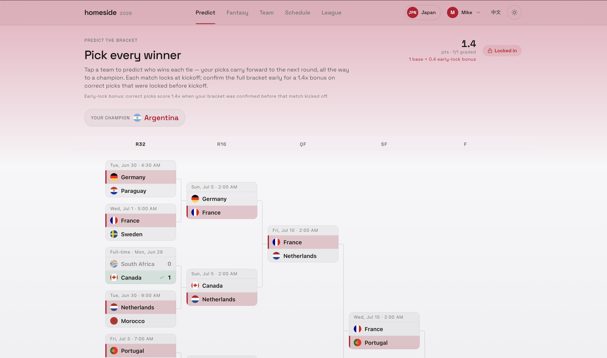
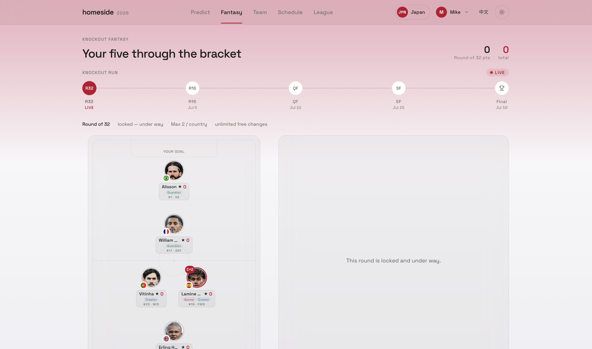
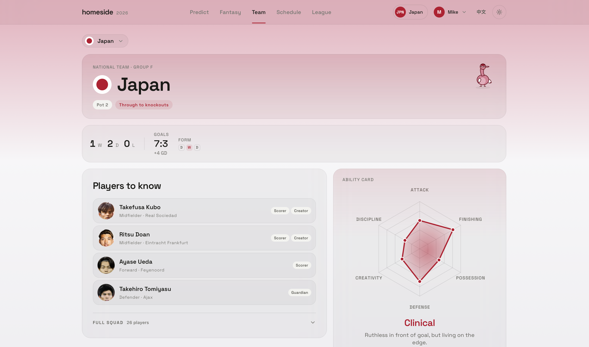
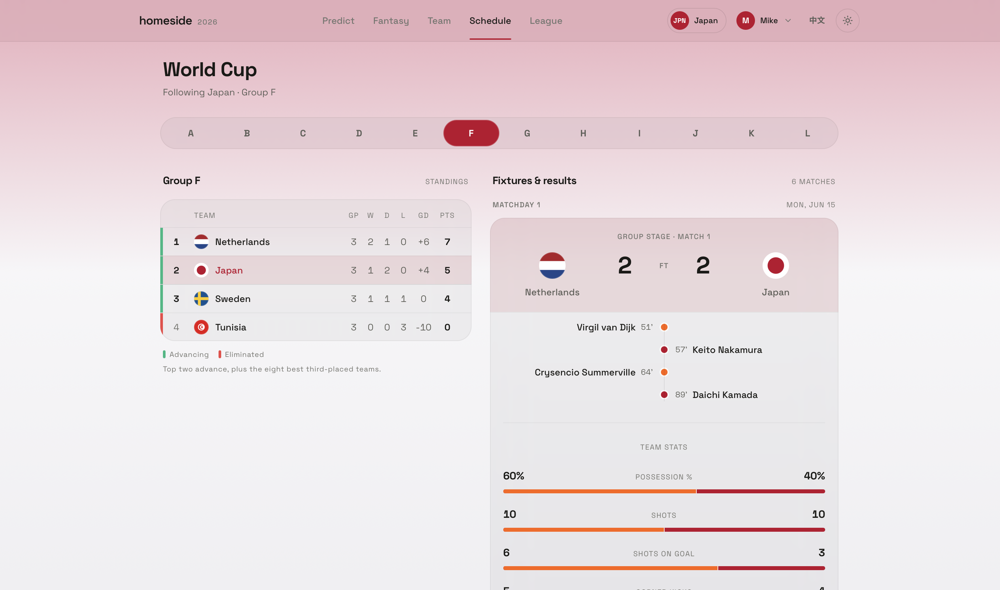
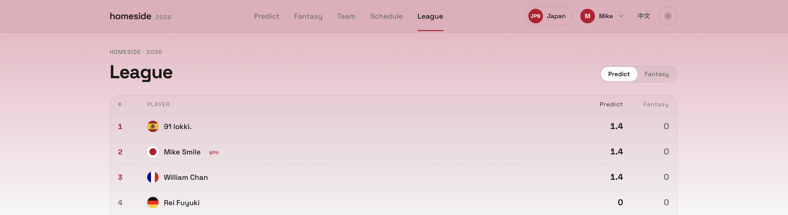

# Homeside

[**English**](README.md) · [**繁體中文**](README.zh-TW.md)

Homeside is an unofficial 2026 World Cup companion app focused on two games:
knockout bracket prediction and a small fantasy roster game. Around those games
it provides a home-team experience, live-ish schedule/results, team pages, and an
optional private league leaderboard.

## What It Does

### Predict *(requires sign-in)*
Pick every knockout winner from the Round of 32 through the final. Picks propagate forward through the bracket, lock per match at kickoff, and are scored only when real matches finish. Confirm the full bracket early for a 1.4× bonus.



### Fantasy *(requires sign-in)*
Build a 5-player knockout roster each round: GK, DEF, MID, FWD, and FLEX. Supports captains, transfers, country quotas, eliminated-team handling, player photos, and key-player markers.



### Team
Browse every national team — home team styling and mascot, form, next match, squad, key players, and an ability radar card built from real match stats.



### Schedule
Group standings, fixtures, live score display, qualification state, and finished-match reports with goal timelines and team stats.



### League *(requires sign-in)*
Supabase-backed leaderboard showing Predict and Fantasy scores side by side across all signed-in players.



## Current Scoring

### Predict

Predict scores one thing: did the user pick the real winner of a finished
knockout match before that match kicked off?

| Stage | Correct pick |
| --- | ---: |
| Round of 32 | 1 |
| Round of 16 | 2 |
| Quarter-final | 3 |
| Semi-final | 5 |
| Third-place match | 1 |
| Final | 8 |

The base perfect bracket is 63 points. A user does not have to lock the full
bracket to play: each match can be picked or changed until its own kickoff. Picks
recorded after kickoff are treated as late and score nothing.

Confirming the full bracket is an optional early-lock bonus. If the full bracket
was confirmed before a match kicked off, a correct pick for that match scores
1.4x. Matches that had already kicked off before the bracket was confirmed do not
get the bonus. There is no scoreline prediction, margin bonus, upset bonus,
streak bonus, or extra champion bonus.

### Fantasy

Fantasy scoring uses only fields the current ESPN feed can supply reliably:

| Event | Points |
| --- | --- |
| Goal | FWD +4, MID +5, DEF/GK +6 |
| Assist | +3 |
| Clean sheet | DEF/GK +4, MID +1 |
| GK saves | +1 per 3 saves |
| In-play penalty scored | goal points by position |
| In-play penalty missed | -2 |
| Shootout kick scored | +2 |
| Shootout kick missed | -1 |
| Yellow card | -1 |
| Red card | -3 |
| Own goal | -2 |

There are no appearance, minutes, tackles, interceptions, recoveries,
clearances, blocks, passing, possession, xG, or xA fantasy points.

## Data Sources

- Static tournament seed data lives in `src/data/*`: teams, fixtures, bracket
  wiring, squads, team stats, player photos, flags, and key-player metadata.
- The seed snapshot is recorded in `src/data/meta.ts` and is currently verified
  as of `2026-06-25`.
- Runtime match data comes from ESPN's public soccer site API through local
  proxy routes:
  - `GET /api/fixtures`
  - `GET /api/fixtures?date=YYYY-MM-DD`
  - `GET /api/match?fixture=ESPN_EVENT_ID`
- The app never fabricates future results. If ESPN data is unavailable, it keeps
  using the committed seed snapshot.
- Supabase is optional and stores raw user state: predictions, fantasy rosters,
  home team, and display name. Scores are recomputed client-side from match data.

## Stack

- Vite
- React 18
- TypeScript
- Tailwind CSS
- React Router
- Supabase client, optional
- Vercel Edge-style API handlers in `api/`
- Vitest for domain tests

## Local Development

```bash
npm install
npm run dev
```

The Vite dev server also serves the `api/` routes, so Vercel CLI is not required
for local development.

Useful scripts:

```bash
npm run typecheck
npm run build
npm run test
npm run preview
```

Optional local Supabase env:

```bash
VITE_SUPABASE_URL=...
VITE_SUPABASE_ANON_KEY=...
```

When these are absent, auth and the League tab stay disabled. Local state still
works through `localStorage`.

## Deploying

The app is intended for Vercel as a Vite project.

1. Import the repo.
2. Use the Vite framework preset.
3. Optionally set `VITE_SUPABASE_URL` and `VITE_SUPABASE_ANON_KEY`.
4. Deploy.

The API routes under `api/` are detected automatically, and `vercel.json` keeps
client-side routing working for the SPA.

## Project Structure

```text
api/                  ESPN proxy routes and shared proxy helper
docs/                 setup/design notes
exports/              generated export artifacts
public/players/       downloaded player portraits
scripts/              seed, squad, ESPN, and player-photo utilities
supabase/             optional league schema
src/
  components/         reusable UI, player avatars, flags, mascot art
  data/               generated/static tournament data
  domain/             pure scoring, bracket, standings, fantasy, ratings logic
  lib/                API normalization, i18n helpers, Supabase client, utilities
  screens/            Predict, Fantasy, Team, Schedule, League, Home
  state/              app, auth, game, language, and theme state
```

## Core Files

- `src/domain/predict.ts`: bracket prediction scoring and predicted-bracket
  propagation.
- `src/domain/bracket.ts`: real bracket resolution from group standings and
  finished knockout results.
- `src/domain/fantasy.ts`: roster slots, fantasy scoring, transfers, and quotas.
- `src/domain/fantasyRounds.ts`: round locks, current round, and live polling
  windows.
- `src/state/store.tsx`: home team, theme color, ESPN result polling, and seed
  merge.
- `src/state/games.tsx`: prediction/fantasy state, local persistence, Supabase
  sync, and predict lock state.
- `src/screens/Predict.tsx`: bracket prediction UI.
- `src/screens/Fantasy.tsx`: fantasy roster UI and round scoring display.
- `src/screens/Team.tsx`: team browsing, key players, squad, and ability card.
- `src/screens/Schedule.tsx`: group standings, fixtures, live scores, and match
  reports.
- `src/screens/Leaderboard.tsx`: optional Supabase league leaderboard.

## Generated Data

The seed files are generated by scripts and should be treated as data, not hand
edited unless the task is specifically about correcting the snapshot.

Common scripts:

```bash
node scripts/build-seed.mjs
node scripts/build-squads.mjs
node scripts/build-player-photos.mjs
node scripts/download-player-photos.mjs
node scripts/fetch-espn.mjs
```

## Notes

Homeside is an unofficial fan project. It is not affiliated with FIFA, ESPN, or
any national federation.
